# NanoClaw Architecture Explained

## Overview

NanoClaw is a personal Claude assistant that connects to WhatsApp (and other channels), routing messages to isolated AI agent containers. Each group gets its own container with isolated filesystem and memory.

## High-Level Architecture

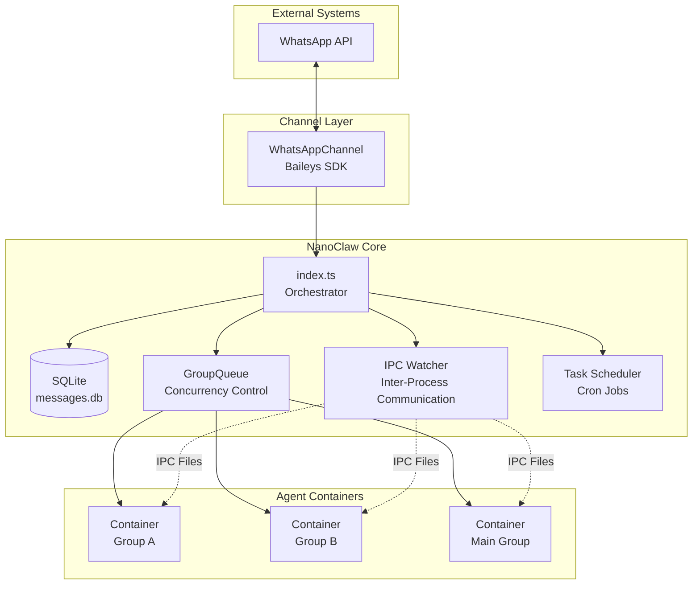

## Message Flow

### 1. Incoming Message Flow

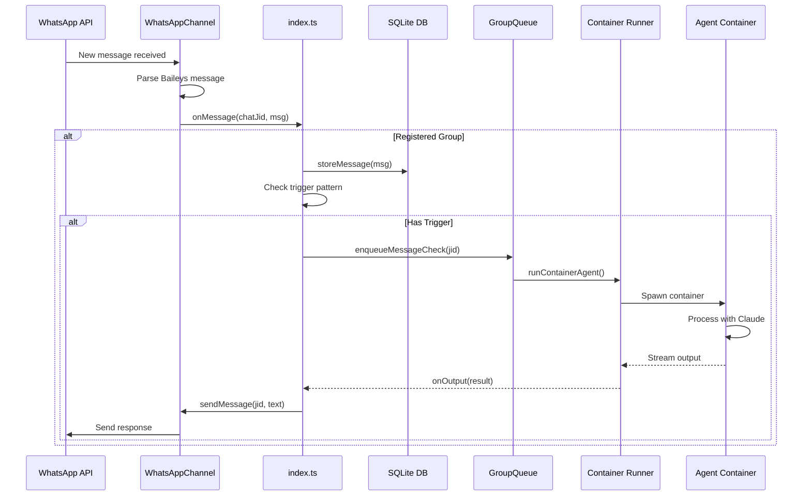

### 2. Container Lifecycle

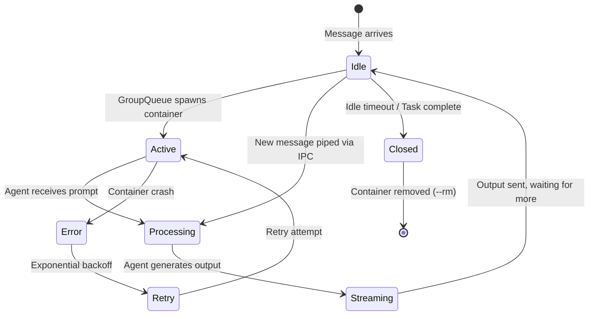

## Core Components

### 1. Orchestrator (src/index.ts)

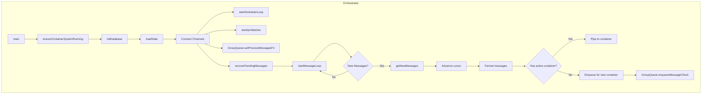

### 2. WhatsApp Channel (src/channels/whatsapp.ts)

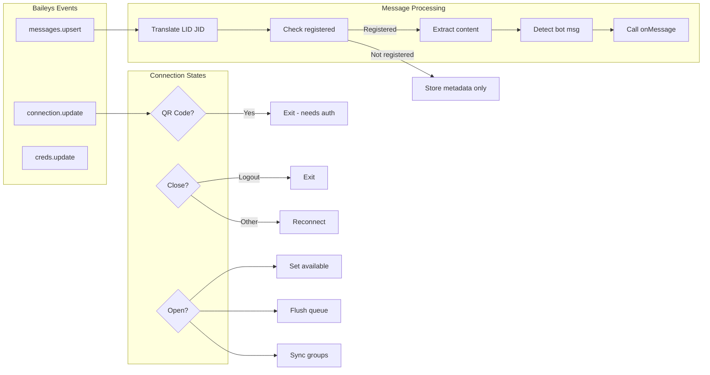

### 3. Group Queue (src/group-queue.ts)

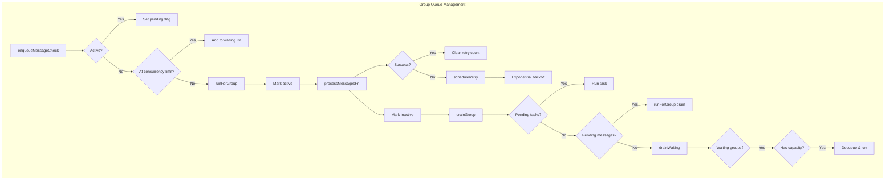

### 4. Container Runner (src/container-runner.ts)

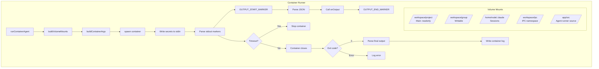

### 5. Database Layer (src/db.ts)

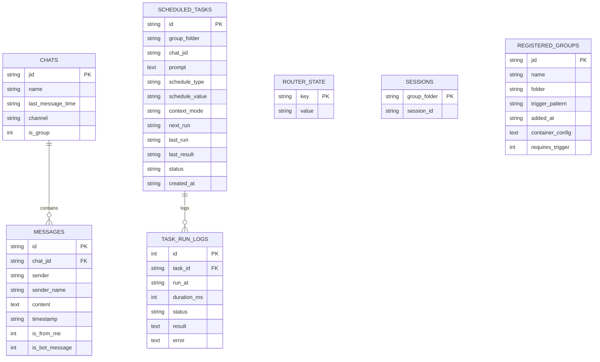

### 6. IPC System (src/ipc.ts)

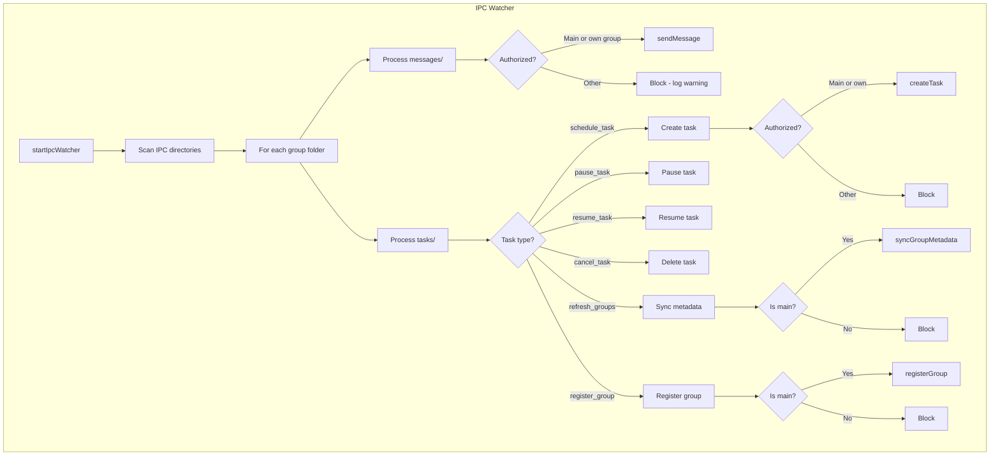

### 7. Task Scheduler (src/task-scheduler.ts)

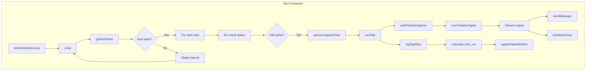

## Security & Isolation

### Container Isolation Model

```mermaid
graph TB
    subgraph Host["Host Machine"]
        NC[NanoClaw Core]
        DB[(SQLite DB)]

        subgraph DataDir["data/"]
            IPC[ipc/]
            SESSIONS[sessions/]
        end
    end

    subgraph GroupA["Group A Container"]
        GA_WORKSPACE[/workspace/group<br/>Writable/]
        GA_CLAUDE[/home/node/.claude<br/>Isolated/]
        GA_IPC[/workspace/ipc<br/>Namespace A/]
        GA_AGENT[Agent Runner]
    end

    subgraph GroupB["Group B Container"]
        GB_WORKSPACE[/workspace/group<br/>Writable/]
        GB_CLAUDE[/home/node/.claude<br/>Isolated/]
        GB_IPC[/workspace/ipc<br/>Namespace B/]
        GB_AGENT[Agent Runner]
    end

    subgraph MainGroup["Main Group Container"]
        M_WORKSPACE[/workspace/group<br/>Writable/]
        M_PROJECT[/workspace/project<br/>Read-only/]
        M_CLAUDE[/home/node/.claude<br/>Isolated/]
        M_IPC[/workspace/ipc<br/>Main namespace/]
        M_AGENT[Agent Runner]
    end

    NC --> DB
    NC -->|Spawn| GroupA
    NC -->|Spawn| GroupB
    NC -->|Spawn| MainGroup

    IPC -.->|messages/| GA_IPC
    IPC -.->|messages/| GB_IPC
    IPC -.->|messages/| M_IPC

    SESSIONS -.->|Group A| GA_CLAUDE
    SESSIONS -.->|Group B| GB_CLAUDE
    SESSIONS -.->|Main| M_CLAUDE
```

### Authorization Matrix

| Action                    | Main Group        | Non-Main Group     |
| ------------------------- | ----------------- | ------------------ |
| Register new groups       | ✅ Yes            | ❌ No              |
| Schedule tasks            | ✅ All groups     | ⚠️ Own group only  |
| Pause/Resume/Cancel tasks | ✅ All            | ⚠️ Own only        |
| Send messages             | ✅ All registered | ⚠️ Own group only  |
| Refresh group metadata    | ✅ Yes            | ❌ No              |
| See all available groups  | ✅ Yes            | ❌ No (empty list) |

## State Management

### Persistence Flow

```mermaid
flowchart LR
    subgraph State["In-Memory State"]
        A[lastTimestamp]
        B[lastAgentTimestamp]
        C[sessions]
        D[registeredGroups]
    end

    subgraph Database["SQLite Database"]
        E[router_state table]
        F[sessions table]
        G[registered_groups table]
        H[messages table]
    end

    subgraph Filesystem["Filesystem"]
        I[groups/{folder}/]
        J[logs/]
        K[data/ipc/{folder}/]
        L[data/sessions/{folder}/]
    end

    A <-->|loadState/saveState| E
    B <-->|JSON stringify/parse| E
    C <-->|getAllSessions/setSession| F
    D <-->|getAllRegisteredGroups/setRegisteredGroup| G

    D -.->|resolveGroupFolderPath| I
    I --> J
    D -.->|resolveGroupIpcPath| K
    D -.->|session directory| L
```

## Configuration & Triggers

### Trigger Pattern Matching

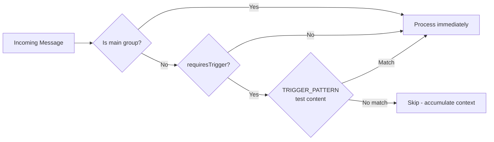

### Message Formatting

```xml
<!-- src/router.ts formatMessages output -->
<messages>
  <message sender="Alice" time="2026-02-24T10:30:00Z">
    Hello @NanoClaw, can you help?
  </message>
  <message sender="Bob" time="2026-02-24T10:31:00Z">
    I need assistance too
  </message>
</messages>
```

## Error Handling & Retries

### Retry Strategy

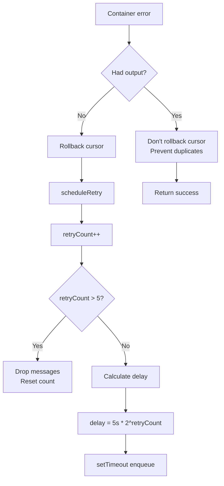

## Startup & Shutdown

### Startup Sequence

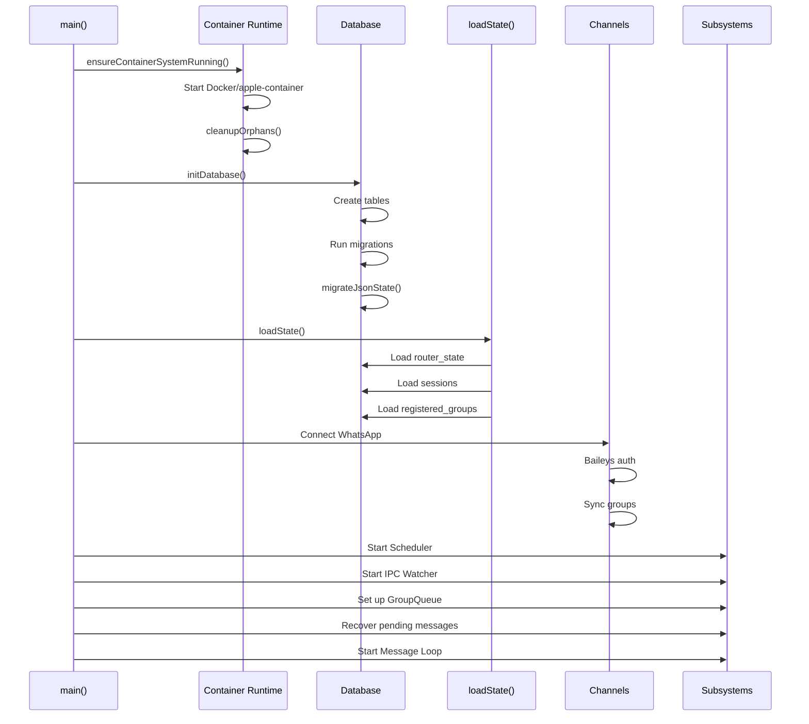

### Graceful Shutdown

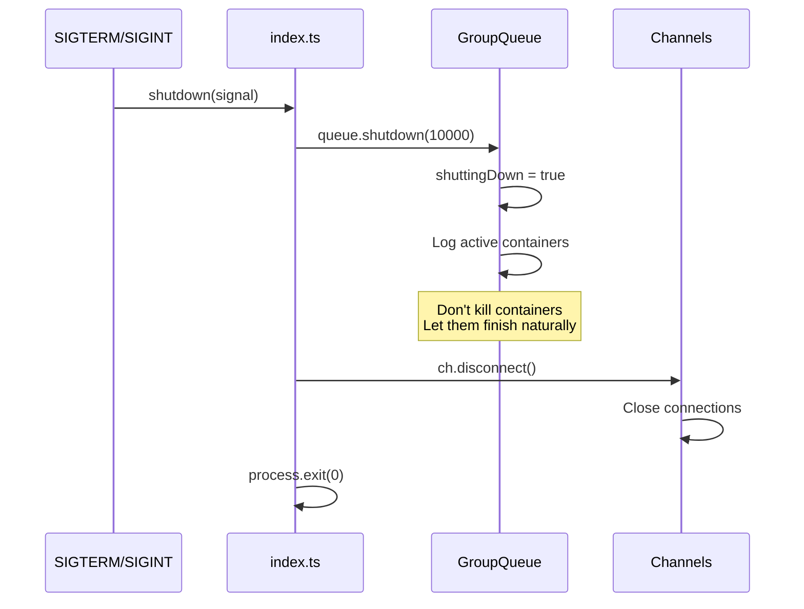

## Directory Structure

```
nanoclaw/
├── src/                    # Core orchestrator code
│   ├── index.ts           # Main orchestrator
│   ├── channels/          # Channel implementations
│   │   └── whatsapp.ts   # Baileys integration
│   ├── container-runner.ts  # Container management
│   ├── group-queue.ts    # Concurrency control
│   ├── db.ts             # Database operations
│   ├── ipc.ts            # IPC watcher
│   ├── task-scheduler.ts # Scheduled tasks
│   └── router.ts         # Message formatting
├── container/             # Agent container
│   ├── Dockerfile
│   ├── agent-runner/     # Agent code
│   └── skills/           # Shared skills
├── groups/               # Group data
│   ├── main/            # Main group workspace
│   ├── {folder}/        # Other groups
│   └── global/          # Shared read-only memory
├── data/                 # Runtime data
│   ├── ipc/             # IPC directories
│   ├── sessions/        # Per-group sessions
│   └── store/           # Database, auth
└── docs/                # Documentation
```

## Key Design Principles

1. **Isolation**: Each group runs in its own container with isolated filesystem
2. **Security**: Main group has elevated privileges; non-main groups are sandboxed
3. **Persistence**: SQLite for metadata, filesystem for group data
4. **IPC**: File-based IPC for container↔orchestrator communication
5. **Streaming**: Agent output streams back in real-time
6. **Queue**: GroupQueue manages concurrency and retries
7. **Recovery**: Cursor-based message tracking with rollback on error
